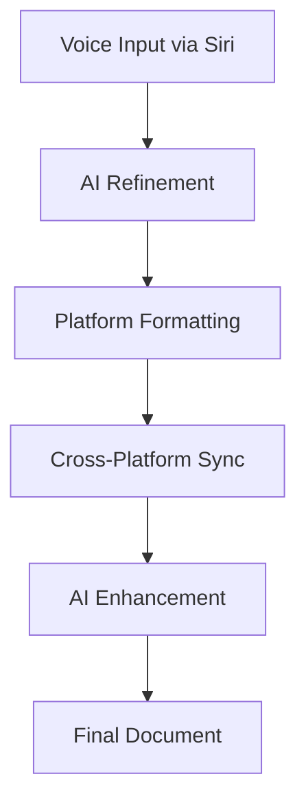
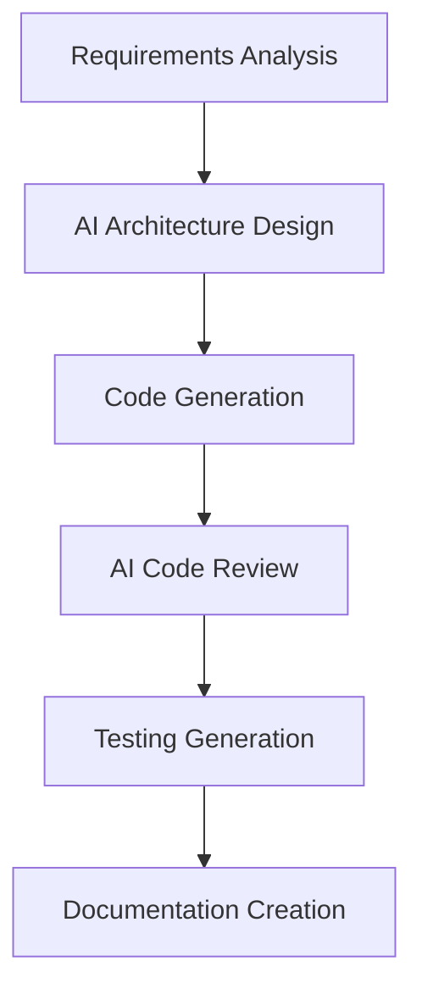
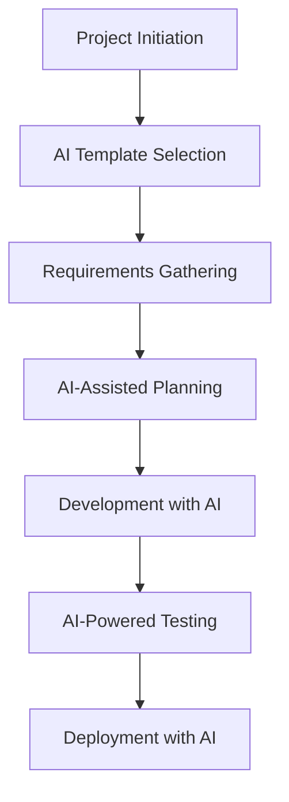

# Development Tool Integration

> _A comprehensive guide for integrating AI tools with development workflows and document management systems._

---

## 🧠 AI-Driven Document Workflow

### Official Software Development Documents

#### Core Documentation Hierarchy

1. **Software Requirements Specification (SRS)**
   - Details functional and non-functional software requirements
   - Serves as the foundation for all development decisions
   - Provides context for AI-driven feature development

2. **Software Architecture Document (SAD) / Architecture Design Document (ADD)**
   - Describes the system's structure, components, and interactions
   - Guides AI to understand system architecture
   - Essential for AI-assisted architectural decisions

3. **Software Design Document (SDD)**
   - Provides detailed description of software design
   - Includes data structures, algorithms, and module-specific details
   - Offers detailed insights for feature implementation

4. **Product Roadmap**
   - Outlines the product's vision, direction, and evolution over time
   - Provides context on long-term vision
   - Guides strategic AI-assisted planning

#### Supporting Documentation

- **User Stories / Use Cases**
  - Describe user interactions with the system to achieve specific goals
  - Serve as direct prompts for code writing
  - Essential for AI-driven feature development

- **Test Plan / Test Cases**
  - Outline testing objectives, scope, resources
  - Provide step-by-step instructions for feature testing
  - Aid in generating various tests (unit, integration, end-to-end)

- **API Specification**
  - Details API endpoints, request/response formats, authentication, and usage rules
  - Consider using OpenAPI for standardization
  - Helps in creating accurate API endpoints and client code

- **Data Model / Schema**
  - Describes the data structure, including tables, fields, relationships, and data types
  - Supports database migrations and ORM code development
  - Essential for AI-assisted database design

- **Deployment / Operational Documents**
  - Includes Deployment Plans and System Administration Guides
  - Assists in writing deployment scripts (e.g., Dockerfiles, Kubernetes manifests)
  - Essential for AI-assisted DevOps

- **Quality Attributes Specification**
  - Defines non-functional requirements like performance, security, reliability, and scalability
  - Includes metrics for measuring quality attributes
  - Guides AI-assisted optimization decisions

### Recommended Structure for AI-Driven Workflow

#### High-Level Planning
- **Product Roadmap:** Provides context on long-term vision
- **SRS:** Defines "what" features to plan

#### Architectural & Design
- **SAD:** Guides AI to understand system structure
- **SDD:** Offers detailed insights for feature implementation

#### Implementation
- **User Stories / Use Cases:** Serve as direct prompts for code writing
- **API Specification:** Helps in creating accurate API endpoints and client code
- **Data Model / Schema:** Supports database migrations and ORM code development

#### Testing & Deployment
- **Test Plan / Test Cases:** Aid in generating various tests (unit, integration, end-to-end)
- **Deployment Plan:** Assists in writing deployment scripts (e.g., Dockerfiles, Kubernetes manifests)

---

## 🍎 Apple Intelligence Integration

### Seamless Document Composition Concept

#### Overview
Integrate Apple Intelligence with ChatGPT to revolutionize document creation across various platforms such as Obsidian, Apple Notes, Apple Pages, and VS Code for markdown editing. This synergy leverages the advanced natural language understanding of ChatGPT, combined with Apple's ecosystem efficiency, to streamline workflows and enhance productivity.

#### Key Features

**Unified Interface**
- Utilize ChatGPT as a centralized assistant, accessible directly within Obsidian, Apple Notes, Apple Pages, or VS Code
- Consistent AI assistance across all document creation platforms
- Seamless switching between tools without losing context

**Context-Aware Composition**
- Apple Intelligence understands user preferences and document context
- Enables tailored content suggestions and real-time edits
- Adapts AI behavior based on document type and platform

**Cross-Platform Synchronization**
- Documents stay updated across devices through Apple's ecosystem
- Seamless transitions between tools
- Consistent formatting and styling across platforms

**Smart Formatting**
- Leverage ChatGPT's capabilities to apply appropriate formatting styles
- Markdown for VS Code, rich text for Pages, etc.
- Automatic style adaptation based on target platform

**Voice-Driven Input**
- Integrate with Siri to dictate notes or document ideas directly
- ChatGPT refining and structuring content on the go
- Hands-free document creation and editing

#### Use Cases

**Research and Documentation**
- Draft research articles in Obsidian, with AI-generated outlines and references
- Create comprehensive documentation with automatic formatting
- Generate technical specifications with AI assistance

**Business and Reporting**
- Create polished reports in Apple Pages, enhanced by AI-driven data analysis and formatting
- Generate executive summaries with AI assistance
- Create presentation materials with intelligent content suggestions

**Note-Taking and Organization**
- Manage quick notes in Apple Notes, later evolving them into detailed documents via ChatGPT assistance
- Organize thoughts and ideas with AI-powered structure
- Convert rough notes into formal documentation

**Code and Technical Writing**
- Edit and format markdown files in VS Code efficiently
- AI auto-correcting syntax and suggesting improvements
- Generate technical documentation with code examples

---

## 🔧 Development Tool Integration Strategies

### IDE and Editor Integration

#### VS Code Integration
```json
{
  "ai.assistant.enabled": true,
  "ai.assistant.provider": "anthropic",
  "ai.assistant.contextWindow": "smart",
  "ai.assistant.autoSuggest": true,
  "ai.assistant.codeReview": true
}
```

**Features**:
- Inline code suggestions and completions
- Automated code review and improvement suggestions
- Context-aware documentation generation
- Intelligent refactoring assistance

#### Obsidian Integration
```yaml
# Obsidian AI Plugin Configuration
ai_assistant:
  provider: anthropic
  context_files: 10
  auto_link: true
  smart_suggestions: true
  voice_input: true
```

**Features**:
- Smart note linking and organization
- AI-powered content generation
- Voice-to-text with AI refinement
- Automatic knowledge graph updates

### Cross-Platform Workflow

#### Document Creation Pipeline
1. **Voice Input** → Siri captures initial thoughts
2. **AI Refinement** → ChatGPT structures and formats content
3. **Platform Adaptation** → Content formatted for target platform
4. **Synchronization** → Updates propagate across devices
5. **Iteration** → AI suggests improvements and refinements

#### Code Development Pipeline
1. **Requirements** → AI analyzes SRS and user stories
2. **Architecture** → AI suggests system design based on SAD
3. **Implementation** → AI assists with code generation
4. **Testing** → AI generates test cases and scenarios
5. **Documentation** → AI creates comprehensive documentation

---

## 📋 Action Items and Implementation

### Immediate Tasks

#### Template Organization
- [ ] Organize Template folder into individual documents
- [ ] Create modular template system for different project types
- [ ] Implement template versioning and migration paths
- [ ] Set up template validation and security checks

#### Documentation Consolidation
- [ ] Convert existing PDF notes to markdown format
- [ ] Organize documentation into hierarchical structure
- [ ] Implement AI-friendly document formatting
- [ ] Create documentation templates for different project types

#### GitHub Project Standardization
- [ ] Fix GitHub Project Templates across all repositories
- [ ] Implement consistent template structure
- [ ] Create master GitHub Project for overview
- [ ] Set up automated template deployment

#### Development Environment Setup
- [ ] Configure AI tools for development workflow
- [ ] Set up cross-platform synchronization
- [ ] Implement voice input and AI refinement
- [ ] Create development environment documentation

### Long-term Goals

#### AI-Enhanced Development
- [ ] Implement AI-assisted code review
- [ ] Set up automated documentation generation
- [ ] Create AI-powered testing frameworks
- [ ] Develop intelligent project management tools

#### Cross-Platform Integration
- [ ] Implement seamless Apple ecosystem integration
- [ ] Create unified AI assistant across platforms
- [ ] Set up automated synchronization
- [ ] Develop platform-specific optimizations

#### Quality Assurance
- [ ] Implement AI-powered quality gates
- [ ] Set up automated security scanning
- [ ] Create performance monitoring with AI insights
- [ ] Develop comprehensive testing strategies

---

## 🎯 Implementation Strategy

### Phase 1: Foundation (Weeks 1-4)
- [ ] Set up basic AI tool integration
- [ ] Organize existing documentation
- [ ] Create template system foundation
- [ ] Implement basic cross-platform synchronization

### Phase 2: Enhancement (Weeks 5-8)
- [ ] Implement advanced AI features
- [ ] Set up voice input and AI refinement
- [ ] Create comprehensive documentation templates
- [ ] Implement automated quality checks

### Phase 3: Optimization (Weeks 9-12)
- [ ] Optimize AI tool performance
- [ ] Implement advanced cross-platform features
- [ ] Create AI-powered development workflows
- [ ] Set up comprehensive monitoring and analytics

### Phase 4: Scaling (Ongoing)
- [ ] Scale AI integration across projects
- [ ] Implement advanced AI features
- [ ] Create AI-powered project management
- [ ] Develop intelligent automation systems

---

## 🔄 Workflow Integration Examples

### Document Creation Workflow


### Code Development Workflow


### Project Management Workflow


---

## 📊 Success Metrics

### Productivity Metrics
- **Documentation Speed**: 50% reduction in documentation creation time
- **Code Quality**: 30% improvement in code review efficiency
- **Project Velocity**: 25% increase in development speed
- **Error Reduction**: 40% decrease in documentation and code errors

### Quality Metrics
- **Documentation Completeness**: 90% coverage of required documentation
- **Code Coverage**: 85% test coverage with AI assistance
- **Security Compliance**: 100% security requirement coverage
- **User Satisfaction**: 4.5/5 rating for AI-assisted workflows

### Integration Metrics
- **Cross-Platform Sync**: 99% synchronization accuracy
- **AI Response Time**: <2 seconds for AI suggestions
- **Voice Recognition**: 95% accuracy for voice input
- **Template Adoption**: 80% of projects using standardized templates

---

## 🎯 Key Takeaways

### AI Integration Principles
- **Context Awareness**: AI tools must understand project context
- **Seamless Integration**: AI should enhance, not disrupt, existing workflows
- **Cross-Platform Consistency**: Unified experience across all tools
- **Quality Assurance**: AI assistance must maintain or improve quality

### Development Workflow Principles
- **Documentation First**: Comprehensive documentation enables better AI assistance
- **Template Standardization**: Consistent templates improve AI effectiveness
- **Iterative Improvement**: Continuous refinement of AI integration
- **Human Oversight**: AI assistance with human validation

### Tool Integration Principles
- **Unified Interface**: Consistent AI experience across all tools
- **Platform Optimization**: Leverage platform-specific capabilities
- **Synchronization**: Seamless data flow between tools
- **Extensibility**: Easy to add new tools and capabilities

---

*This comprehensive guide provides the foundation for integrating AI tools with development workflows, creating a seamless and productive development environment that leverages the best of both human creativity and AI assistance.* 