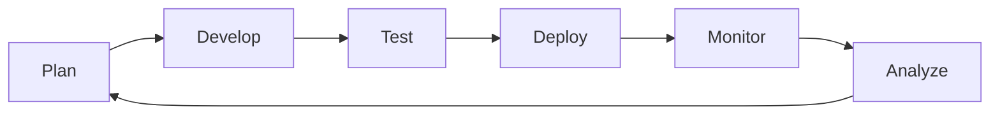

# ✅ Unified Quality Assurance & Compliance Framework

> _Comprehensive guide for quality assurance, code standards, compliance, and process validation in AI-augmented development._

---

## 🎯 Purpose & Scope

This guide consolidates all quality-related standards, processes, and templates. It covers:
- Quality assurance principles and validation
- Code quality standards and best practices
- Compliance requirements and checklists
- Automated testing and review processes
- Security and performance standards
- Continuous improvement frameworks

---

## 🧠 Quality Philosophy

### Core Principles
1. **Quality by Design**: Build quality into every phase, not just testing
2. **Automation First**: Automate repetitive quality checks
3. **Continuous Validation**: Regular feedback loops and improvements
4. **Security by Default**: Every feature considers security implications
5. **Performance Aware**: Profile and optimize based on metrics

### Success Metrics
- **Code Coverage**: >80% for new code, >70% overall
- **Build Success Rate**: >95% on main branch
- **Bug Discovery Rate**: <5% post-release
- **Documentation Currency**: Updated within 1 sprint
- **Security Scan Pass Rate**: 100% for critical/high issues

---

## 📊 Quality Assessment Framework

### Process Maturity Levels

| Level | Description | Characteristics |
|-------|-------------|-----------------|
| **Level 1: Ad-hoc** | Reactive, inconsistent | No formal processes |
| **Level 2: Managed** | Basic processes defined | Some automation |
| **Level 3: Defined** | Standardized across project | Consistent application |
| **Level 4: Measured** | Metrics-driven decisions | Data-backed improvements |
| **Level 5: Optimized** | Continuous improvement | Self-healing systems |

### Current Assessment Areas

| Area | Current Level | Target | Gap Analysis |
|------|--------------|--------|--------------|
| **Documentation** | Level 3 | Level 4 | Need metrics tracking |
| **Testing** | Level 2 | Level 4 | Expand automation |
| **Code Quality** | Level 3 | Level 4 | Implement quality gates |
| **Security** | Level 2 | Level 3 | Standardize scanning |
| **Performance** | Level 2 | Level 3 | Add monitoring |

---

## 🔍 Code Quality Standards

### General Standards

#### Naming Conventions
- **Variables**: camelCase for JS/TS, snake_case for Python
- **Functions**: Verb prefixes (get, set, create, update, delete)
- **Classes**: PascalCase, noun-based
- **Constants**: SCREAMING_SNAKE_CASE
- **Files**: kebab-case for URLs, snake_case for modules

#### Code Structure
```javascript
// ✅ Good: Small, focused functions
function calculateTax(amount, rate) {
    return amount * rate;
}

function formatCurrency(amount) {
    return `$${amount.toFixed(2)}`;
}

// ❌ Bad: Doing too much
function processOrder(order) {
    // validation, calculation, formatting, saving...
}
```

#### Documentation Requirements
- All public APIs must have documentation
- Complex algorithms need inline comments
- README for each module/package
- Examples for non-obvious usage

### Language-Specific Standards

#### JavaScript/TypeScript
```typescript
// Configuration: .eslintrc.json
{
    "extends": ["eslint:recommended", "airbnb-base"],
    "rules": {
        "no-console": "warn",
        "prefer-const": "error",
        "no-var": "error",
        "arrow-body-style": ["error", "as-needed"]
    }
}

// Type Safety Requirements
interface UserData {
    id: string;
    name: string;
    email: string;
    createdAt: Date;
}

// Always define return types
function getUser(id: string): Promise<UserData> {
    // implementation
}
```

#### Python
```python
# Follow PEP 8 strictly
# Configuration: .pylintrc, pyproject.toml

from typing import List, Optional, Dict
import logging

logger = logging.getLogger(__name__)

class DataProcessor:
    """Process data according to business rules."""
    
    def __init__(self, config: Dict[str, any]) -> None:
        """Initialize processor with configuration."""
        self.config = config
    
    def process(self, data: List[dict]) -> Optional[dict]:
        """
        Process input data and return results.
        
        Args:
            data: List of dictionaries containing raw data
            
        Returns:
            Processed data or None if processing fails
            
        Raises:
            ValueError: If data format is invalid
        """
        if not data:
            logger.warning("Empty data provided")
            return None
            
        # Processing logic here
        return processed_data
```

#### SQL
```sql
-- Standards for database queries
-- Always use explicit column names
SELECT 
    u.id,
    u.username,
    u.email,
    p.full_name
FROM users u
INNER JOIN profiles p ON u.id = p.user_id
WHERE u.status = 'active'
    AND u.created_at >= '2024-01-01'
ORDER BY u.created_at DESC
LIMIT 100;

-- Use meaningful aliases
-- Format for readability
-- Include appropriate indexes
```

---

## 🧪 Testing Standards

### Test Coverage Requirements

| Test Type | Coverage Target | Priority |
|-----------|----------------|----------|
| **Unit Tests** | 80% minimum | Critical |
| **Integration Tests** | 60% minimum | High |
| **E2E Tests** | Critical paths | High |
| **Performance Tests** | Key operations | Medium |
| **Security Tests** | All endpoints | Critical |

### Test Structure Template

```javascript
describe('ComponentName', () => {
    // Setup
    beforeEach(() => {
        // Test setup
    });
    
    // Group related tests
    describe('methodName', () => {
        it('should handle normal case', () => {
            // Arrange
            const input = { /* test data */ };
            
            // Act
            const result = methodName(input);
            
            // Assert
            expect(result).toEqual(expectedOutput);
        });
        
        it('should handle edge cases', () => {
            // Test boundary conditions
        });
        
        it('should handle errors gracefully', () => {
            // Test error scenarios
        });
    });
});
```

### Test Data Management
- Use factories for test data creation
- Maintain separate test databases
- Mock external dependencies
- Use deterministic test data

---

## 🔒 Security Standards

### Security Checklist

#### Authentication & Authorization
- [ ] Multi-factor authentication available
- [ ] JWT tokens expire appropriately
- [ ] Role-based access control (RBAC) implemented
- [ ] Session management secure
- [ ] Password policy enforced

#### Data Protection
- [ ] Sensitive data encrypted at rest
- [ ] TLS/SSL for data in transit
- [ ] PII data minimization
- [ ] GDPR compliance measures
- [ ] Data retention policies

#### Input Validation
- [ ] All inputs sanitized
- [ ] SQL injection prevention
- [ ] XSS protection
- [ ] CSRF tokens implemented
- [ ] File upload restrictions

#### Security Testing
```bash
# Automated security scanning
npm audit
snyk test
bandit -r ./src

# OWASP dependency check
dependency-check --scan ./ --out ./security-report
```

### Secure Coding Practices

```javascript
// ✅ Good: Parameterized queries
const query = 'SELECT * FROM users WHERE id = ?';
db.query(query, [userId], callback);

// ❌ Bad: String concatenation
const query = 'SELECT * FROM users WHERE id = ' + userId;

// ✅ Good: Input validation
function validateEmail(email) {
    const emailRegex = /^[^\s@]+@[^\s@]+\.[^\s@]+$/;
    if (!emailRegex.test(email)) {
        throw new ValidationError('Invalid email format');
    }
    return email.toLowerCase().trim();
}

// ✅ Good: Secure password handling
const bcrypt = require('bcrypt');
const saltRounds = 10;

async function hashPassword(password) {
    return bcrypt.hash(password, saltRounds);
}

async function verifyPassword(password, hash) {
    return bcrypt.compare(password, hash);
}
```

---

## ⚡ Performance Standards

### Performance Targets

| Metric | Target | Critical Threshold |
|--------|--------|-------------------|
| **Page Load Time** | <2s | >5s |
| **API Response Time** | <200ms | >1s |
| **Database Query Time** | <100ms | >500ms |
| **Time to Interactive** | <3s | >10s |
| **Memory Usage** | <500MB | >1GB |
| **CPU Usage** | <70% | >90% |

### Performance Optimization Guidelines

```javascript
// ✅ Good: Efficient data structures
const userMap = new Map();
users.forEach(user => userMap.set(user.id, user));
const user = userMap.get(userId); // O(1) lookup

// ❌ Bad: Inefficient search
const user = users.find(u => u.id === userId); // O(n) lookup

// ✅ Good: Debouncing expensive operations
function debounce(func, wait) {
    let timeout;
    return function executedFunction(...args) {
        const later = () => {
            clearTimeout(timeout);
            func(...args);
        };
        clearTimeout(timeout);
        timeout = setTimeout(later, wait);
    };
}

// ✅ Good: Lazy loading
const HeavyComponent = lazy(() => import('./HeavyComponent'));
```

### Database Optimization
```sql
-- Use appropriate indexes
CREATE INDEX idx_users_email ON users(email);
CREATE INDEX idx_orders_user_date ON orders(user_id, created_at);

-- Optimize queries
EXPLAIN ANALYZE SELECT ... ; -- Analyze query performance

-- Use pagination
SELECT * FROM large_table
LIMIT 100 OFFSET 0;
```

---

## 🔄 Review Process

### Code Review Checklist

#### Functionality
- [ ] Code works as intended
- [ ] Edge cases handled
- [ ] Error handling appropriate
- [ ] No obvious bugs

#### Code Quality
- [ ] Follows coding standards
- [ ] DRY principle applied
- [ ] Clear variable/function names
- [ ] Appropriate comments

#### Testing
- [ ] Tests included for new code
- [ ] Tests pass locally
- [ ] Coverage maintained/improved
- [ ] Edge cases tested

#### Security
- [ ] No sensitive data exposed
- [ ] Input validation present
- [ ] Authentication/authorization correct
- [ ] Dependencies up to date

#### Performance
- [ ] No obvious performance issues
- [ ] Efficient algorithms used
- [ ] Database queries optimized
- [ ] Caching implemented where appropriate

#### Documentation
- [ ] API documentation updated
- [ ] README updated if needed
- [ ] Inline comments for complex logic
- [ ] CHANGELOG entry added

### Pull Request Template

```markdown
## Description
Brief description of changes

## Type of Change
- [ ] Bug fix
- [ ] New feature
- [ ] Breaking change
- [ ] Documentation update

## Testing
- [ ] Unit tests pass
- [ ] Integration tests pass
- [ ] Manual testing completed

## Checklist
- [ ] Code follows style guidelines
- [ ] Self-review completed
- [ ] Comments added for complex code
- [ ] Documentation updated
- [ ] No new warnings generated
- [ ] Tests added/updated
- [ ] All tests passing

## Related Issues
Fixes #(issue number)

## Screenshots (if applicable)
```

---

## 🚨 Issue Management

### Issue Severity Levels

| Level | Description | Response Time | Resolution Time |
|-------|-------------|---------------|-----------------|
| **Critical** | System down, data loss risk | 1 hour | 4 hours |
| **High** | Major feature broken | 4 hours | 1 day |
| **Medium** | Minor feature issues | 1 day | 3 days |
| **Low** | Cosmetic, nice-to-have | 1 week | Sprint |

### Bug Report Template

```markdown
## Bug Description
Clear description of the bug

## Steps to Reproduce
1. Step one
2. Step two
3. Step three

## Expected Behavior
What should happen

## Actual Behavior
What actually happens

## Environment
- OS: [e.g., macOS 12.0]
- Browser: [e.g., Chrome 96]
- Version: [e.g., 1.2.3]

## Additional Context
Any other relevant information

## Screenshots/Logs
If applicable
```

---

## 📈 Continuous Improvement

### Feedback Loops



### Improvement Process
1. **Collect Metrics**: Automated tooling for quality metrics
2. **Regular Reviews**: Weekly team retrospectives
3. **Root Cause Analysis**: For repeated issues
4. **Action Items**: Specific, measurable improvements
5. **Track Progress**: Dashboard for quality trends

### Quality Metrics Dashboard

| Metric | Current | Target | Trend |
|--------|---------|--------|-------|
| Code Coverage | 75% | 80% | ↑ |
| Bug Rate | 3/week | <2/week | ↓ |
| Build Success | 92% | >95% | ↑ |
| Review Turnaround | 8 hrs | <4 hrs | → |
| Tech Debt Ratio | 15% | <10% | ↓ |

---

## 🛠️ Automation & CI/CD

### CI/CD Pipeline Stages

```yaml
# .github/workflows/quality.yml
name: Quality Pipeline

on: [push, pull_request]

jobs:
  quality:
    runs-on: ubuntu-latest
    steps:
      - name: Checkout
        uses: actions/checkout@v2
      
      - name: Install Dependencies
        run: npm ci
      
      - name: Lint
        run: npm run lint
      
      - name: Type Check
        run: npm run type-check
      
      - name: Unit Tests
        run: npm test -- --coverage
      
      - name: Security Scan
        run: npm audit
      
      - name: Build
        run: npm run build
      
      - name: Integration Tests
        run: npm run test:integration
      
      - name: Performance Tests
        run: npm run test:performance
      
      - name: Upload Coverage
        uses: codecov/codecov-action@v2
```

### Quality Gates

| Gate | Criteria | Action on Failure |
|------|----------|-------------------|
| **Linting** | No errors | Block merge |
| **Tests** | All pass | Block merge |
| **Coverage** | >80% new code | Warning |
| **Security** | No high/critical | Block merge |
| **Performance** | Within thresholds | Warning |
| **Documentation** | Updated | Warning |

---

## ⚠️ Risk Mitigation

### Potential Weak Spots & Mitigations

| Risk Area | Potential Issue | Mitigation Strategy |
|-----------|----------------|---------------------|
| **Token Limits** | Context cutoff in AI | Modular prompt design |
| **Prompt Drift** | Inconsistent AI output | Version control prompts |
| **Manual Handoffs** | Human error in transitions | Automation scripts |
| **Documentation Lag** | Outdated docs | Automated doc generation |
| **Security Gaps** | Missed vulnerabilities | Automated scanning |

### Contingency Plans
- **Rollback Strategy**: Git tags for stable versions
- **Feature Flags**: Toggle risky features
- **Backup Systems**: Regular automated backups
- **Incident Response**: Documented procedures
- **Communication Plan**: Status page updates

---

## 📌 Action Items & Priorities

### Immediate (This Week)
- [ ] Set up automated linting
- [ ] Create PR template
- [ ] Implement basic security scanning
- [ ] Document current test coverage

### Short-term (This Month)
- [ ] Expand test automation
- [ ] Implement quality gates
- [ ] Create performance baselines
- [ ] Set up monitoring dashboard

### Long-term (This Quarter)
- [ ] Achieve 80% test coverage
- [ ] Implement full CI/CD pipeline
- [ ] Establish security audit process
- [ ] Create quality metrics dashboard

---

## 📚 References & Resources

### Internal Documents
- [Workflow Overview](../01_Core_Workflow/workflow_overview.md)
- [Documentation Standards](../02_Documentation/documentation_standards.md)
- [Implementation Guide](../03_Implementation/implementation_automation.md)
- [Security Architecture](security_architecture.md)

### External Resources
- [OWASP Top 10](https://owasp.org/Top10/)
- [Google Engineering Practices](https://google.github.io/eng-practices/)
- [The Twelve-Factor App](https://12factor.net/)
- [Clean Code Principles](https://github.com/ryanmcdermott/clean-code-javascript)

### Tools & Services
- **Linting**: ESLint, Pylint, RuboCop
- **Testing**: Jest, Pytest, RSpec
- **Security**: Snyk, OWASP ZAP, Bandit
- **Performance**: Lighthouse, WebPageTest, K6
- **Monitoring**: Sentry, DataDog, New Relic

---

## 🎯 Success Criteria

The quality assurance framework is successful when:
- ✅ 90% of bugs caught before production
- ✅ Zero critical security vulnerabilities
- ✅ All team members follow standards consistently
- ✅ Automated checks catch 80% of issues
- ✅ Documentation stays current with code
- ✅ Performance meets or exceeds targets
- ✅ Continuous improvement is measurable

---

*This unified framework ensures your quality assurance and compliance practices are comprehensive, automated, and continuously improving in your AI-augmented development workflow.*