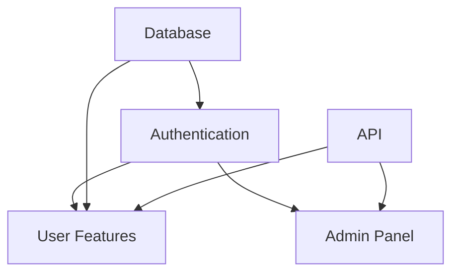

# 05_Project_Management - Project & Sprint Management Framework

> Comprehensive project management framework for planning, executing, and tracking software development projects with AI assistance.

## 📁 Directory Contents

### Core Files

| File | Purpose | Priority |
|------|---------|----------|
| **project_management.md** | Complete project management framework with sprint planning and tracking | 🔥 Essential |
| **project_template_system.md** | Project initialization templates and structures | 🚀 Practical |
| **missing_templates_analysis.md** | Gap analysis and improvement opportunities | 📊 Analysis |
| **forgedesk_brainstorm_2025-08-08.md** | Example brainstorming session and project planning | 💡 Reference |

## 🎯 Purpose

This directory provides everything needed to:
- Plan and execute sprints effectively
- Manage multiple projects simultaneously
- Track progress with meaningful metrics
- Communicate with stakeholders
- Handle risks and dependencies
- Scale from solo to team development

## 📅 Sprint Management Framework

### Sprint Cycle (2 Weeks)

```
Week 1:
Mon-Tue: Planning & Design
Wed-Fri: Core Development

Week 2:
Mon-Wed: Development & Testing
Thu: Review & Refinement
Fri: Deploy & Retrospective
```

### Sprint Ceremonies

| Ceremony | When | Duration | Purpose |
|----------|------|----------|---------|
| **Sprint Planning** | Day 1 | 2 hours | Define sprint goals and commitments |
| **Daily Standup** | Daily | 15 min | Sync progress and blockers |
| **Sprint Review** | Day 13 | 1 hour | Demo completed work |
| **Retrospective** | Day 14 | 1 hour | Improve process |

## 🎯 Milestone Planning

### Milestone Structure

```yaml
milestone:
  name: "v1.0 - MVP Launch"
  duration: "3 months"
  sprints: 6
  
  phases:
    - Foundation (2 sprints)
    - Core Features (2 sprints)
    - Polish & Launch (2 sprints)
  
  deliverables:
    - Working application
    - Documentation
    - Deployment pipeline
  
  success_criteria:
    - All features complete
    - <2s load time
    - Zero critical bugs
```

### Milestone Tracking

| Phase | Sprints | Status | Completion |
|-------|---------|--------|------------|
| **Foundation** | 1-2 | ✅ Complete | 100% |
| **Core Features** | 3-4 | 🚧 In Progress | 65% |
| **Polish** | 5-6 | 📅 Planned | 0% |

## 📊 Project Templates

### New Project Quick Start

```bash
# Initialize new project
./scripts/init-project.sh PROJECT_NAME TYPE

# This creates:
# - Project structure
# - GitHub repository
# - Project board
# - Initial issues
# - Documentation templates
```

### Project Configuration

```yaml
project:
  name: "MyProject"
  type: "web"
  team_size: 1
  
  schedule:
    start_date: "2024-01-15"
    target_release: "2024-04-15"
    sprint_length: 14
    
  stack:
    frontend: "React"
    backend: "Node.js"
    database: "PostgreSQL"
    
  priorities:
    - User authentication
    - Core features
    - Performance optimization
```

## 📋 Project Board Setup

### GitHub Projects Columns

1. **📥 Backlog** - All unplanned work
2. **📋 Sprint Ready** - Refined and estimated
3. **🚧 In Progress** - Active development
4. **👀 Review** - Code review/testing
5. **✅ Done** - Completed this sprint
6. **🚀 Deployed** - In production

### Issue Management

#### Issue Types
- **Feature** (green) - New functionality
- **Bug** (red) - Defects to fix
- **Task** (blue) - Technical work
- **Docs** (purple) - Documentation

#### Priority Labels
- **P0: Critical** - Drop everything
- **P1: High** - This sprint
- **P2: Medium** - Next sprint
- **P3: Low** - Backlog

#### Size Estimates
- **XS** - 1-2 hours
- **S** - 3-4 hours
- **M** - 1-2 days
- **L** - 3-5 days
- **XL** - 1+ week

## 📈 Metrics & Reporting

### Key Performance Indicators

| Metric | Formula | Target | Current |
|--------|---------|--------|---------|
| **Velocity** | Points/Sprint | 40 | 35 |
| **Cycle Time** | Merge-Commit | <3 days | 4 days |
| **Sprint Completion** | Done/Committed | >90% | 87% |
| **Bug Rate** | Bugs/Story | <0.2 | 0.15 |
| **Tech Debt** | Debt/Dev Time | <20% | 18% |

### Sprint Report Template

```markdown
# Sprint X Report

## Completed
- ✅ Feature A (8 points)
- ✅ Bug fixes (5 points)
- ✅ Documentation (3 points)

## Carried Over
- 🔄 Feature B (60% complete)

## Metrics
- Velocity: 16/20 points
- Quality: 2 bugs found
- Team Health: Good

## Next Sprint Focus
- Complete Feature B
- Start Feature C
```

## 🚨 Risk Management

### Risk Matrix

| Risk | Probability | Impact | Mitigation |
|------|------------|--------|------------|
| **Scope Creep** | High | High | Strict change control |
| **Technical Debt** | Medium | High | Regular refactoring |
| **Dependency Delays** | Low | High | Parallel development |
| **Resource Availability** | Low | Medium | Buffer time |

### Dependency Management



## 👥 Stakeholder Communication

### Communication Plan

| Stakeholder | Frequency | Format | Content |
|-------------|-----------|--------|---------|
| **Team** | Daily | Standup | Progress, blockers |
| **Manager** | Weekly | Email | Status update |
| **Client** | Bi-weekly | Demo | Sprint review |
| **Users** | Monthly | Blog | Release notes |

### Status Update Template

```markdown
## Project Status - [Date]

### Summary
[2-3 sentences on overall status]

### Progress
- Completed: X%
- On Track: Yes/No
- Next Milestone: [Date]

### Highlights
- ✅ Major achievement
- 🚧 Current focus
- 📅 Upcoming work

### Issues/Risks
- 🔴 Critical issue (if any)
- 🟡 Risks to monitor

### Decisions Needed
- [ ] Decision 1
- [ ] Decision 2
```

## 🔄 Multi-Project Management

### Portfolio Overview

| Project | Status | Priority | Health | Next Milestone |
|---------|--------|----------|--------|----------------|
| **Core Product** | Active | P0 | 🟢 | v2.0 (Q2) |
| **Mobile App** | Active | P1 | 🟡 | v1.0 (Q2) |
| **Admin Tool** | Maintenance | P2 | 🟢 | Patches |
| **New API** | Planning | P1 | ⚪ | Kickoff |

### Resource Allocation

```
Developer Time Allocation:
- Core Product: 60%
- Mobile App: 30%
- Maintenance: 10%
```

## ✅ Quick Actions

### Start New Sprint
1. Review backlog
2. Estimate stories
3. Plan sprint capacity
4. Commit to goals
5. Create sprint board

### Track Progress
```bash
# Generate sprint metrics
python scripts/sprint-metrics.py

# Update project dashboard
./scripts/update-dashboard.sh

# Generate status report
./scripts/generate-report.sh
```

### Handle Issues
1. Assess severity
2. Update priority
3. Assign owner
4. Track resolution
5. Document lessons

## 🔗 Related Documentation

### Prerequisites
- [Core Workflow](../01_Core_Workflow/README.md) - Understand philosophy
- [Documentation](../02_Documentation/README.md) - Document projects

### Integration
- [Implementation](../03_Implementation/README.md) - Technical execution
- [Quality & Security](../04_Quality_Security/README.md) - Ensure quality

### Templates
- Review `project_template_system.md` for templates
- See `project_management.md` for detailed framework
- Check `missing_templates_analysis.md` for gaps

## 💡 Best Practices

### Planning Do's
- ✅ Break work into small chunks
- ✅ Estimate conservatively
- ✅ Include buffer time
- ✅ Define clear acceptance criteria
- ✅ Prioritize ruthlessly

### Planning Don'ts
- ❌ Overcommit sprints
- ❌ Skip estimation
- ❌ Ignore dependencies
- ❌ Forget documentation time
- ❌ Plan without retrospectives

### Execution Do's
- ✅ Update status daily
- ✅ Communicate blockers early
- ✅ Demo work frequently
- ✅ Track metrics consistently
- ✅ Celebrate wins

### Execution Don'ts
- ❌ Work in isolation
- ❌ Hide problems
- ❌ Skip ceremonies
- ❌ Ignore technical debt
- ❌ Burn out

---

*This directory provides a complete framework for managing software projects from inception to delivery, with support for scaling from solo development to team collaboration.*