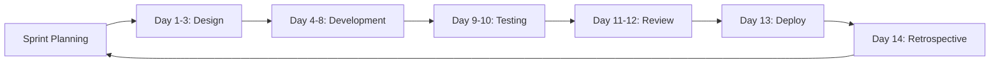
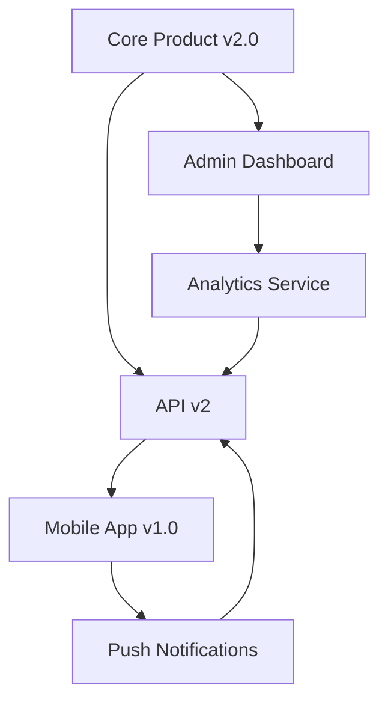

# 📊 Unified Project Management Framework

> _Comprehensive guide for project management, templates, and multi-project orchestration in AI-augmented development._

---

## 🎯 Purpose & Scope

This guide consolidates all project management strategies, templates, and workflows. It covers:
- Project lifecycle management
- Sprint planning and execution
- Template systems for consistency
- Multi-project orchestration
- Stakeholder communication
- Risk and resource management
- Performance tracking and reporting

---

## 🏗️ Project Management Philosophy

### Core Principles
1. **Agile with Structure**: Flexible sprints with clear documentation
2. **AI-First Planning**: Leverage AI for estimation and planning
3. **Continuous Delivery**: Ship incremental value regularly
4. **Data-Driven Decisions**: Metrics guide project direction
5. **Sustainable Pace**: Prevent burnout, maintain quality

### Management Layers

```
Strategic (30,000 ft)
├── Vision & Roadmap (Quarterly)
├── Portfolio Management
└── Resource Allocation

Tactical (10,000 ft)
├── Sprint Planning (Bi-weekly)
├── Milestone Tracking
└── Risk Management

Operational (Ground level)
├── Daily Standups
├── Issue Management
└── Code Reviews
```

---

## 📅 Sprint Management

### Sprint Cycle (2 Weeks)



### Sprint Planning Template

```markdown
# Sprint [NUMBER] Planning
**Duration**: [START_DATE] - [END_DATE]
**Goal**: [Clear, measurable sprint goal]

## Capacity
- **Available Hours**: [TOTAL]
- **Reserved for Meetings**: [HOURS]
- **Reserved for Reviews**: [HOURS]
- **Development Capacity**: [HOURS]

## Committed Stories
| Story | Points | Assignee | Priority |
|-------|--------|----------|----------|
| US-001 | 5 | @dev | P0 |
| US-002 | 3 | @dev | P1 |
| US-003 | 8 | @dev | P1 |

## Success Criteria
- [ ] All P0 stories completed
- [ ] Test coverage maintained >80%
- [ ] Zero critical bugs in production
- [ ] Documentation updated

## Risks & Dependencies
- **Risk**: [Description] → **Mitigation**: [Action]
- **Dependency**: [External factor] → **Plan B**: [Alternative]
```

### Daily Standup Format

```markdown
## Daily Standup - [DATE]

### Yesterday
- ✅ Completed [TASK]
- 🚧 Progress on [TASK]

### Today
- 🎯 Focus: [PRIMARY_TASK]
- 📝 Also: [SECONDARY_TASKS]

### Blockers
- 🚫 [BLOCKER] - Need: [HELP_NEEDED]

### Metrics
- Stories Completed: X/Y
- Sprint Burndown: On Track / At Risk / Behind
```

---

## 🎯 Milestone Management

### Milestone Planning Framework

```yaml
milestone:
  name: "v1.0 - MVP Launch"
  target_date: "2024-06-01"
  status: "in_progress"
  
  objectives:
    - Core features implemented
    - Security audit passed
    - Performance benchmarks met
    - Documentation complete
  
  deliverables:
    - Working application
    - API documentation
    - User guide
    - Deployment scripts
  
  success_metrics:
    - 100% feature completion
    - <2s page load time
    - Zero critical bugs
    - 80% test coverage
  
  phases:
    phase_1:
      name: "Foundation"
      duration: "4 weeks"
      deliverables:
        - Architecture design
        - Database schema
        - CI/CD pipeline
    
    phase_2:
      name: "Core Development"
      duration: "8 weeks"
      deliverables:
        - User authentication
        - Core business logic
        - API endpoints
    
    phase_3:
      name: "Polish & Launch"
      duration: "4 weeks"
      deliverables:
        - UI/UX refinement
        - Performance optimization
        - Production deployment
```

### Milestone Tracking Dashboard

| Milestone | Target Date | Progress | Status | Risk |
|-----------|-------------|----------|--------|------|
| v0.1 Alpha | 2024-03-01 | 100% | ✅ Complete | Low |
| v0.2 Beta | 2024-04-15 | 75% | 🚧 On Track | Low |
| v0.3 RC | 2024-05-15 | 40% | ⚠️ At Risk | Medium |
| v1.0 Release | 2024-06-01 | 25% | 📅 Planned | Low |

---

## 📋 Project Templates

### New Project Initialization

```bash
#!/bin/bash
# scripts/init-project.sh

PROJECT_NAME=$1
PROJECT_TYPE=$2  # web, api, cli, library

# Create project structure
mkdir -p $PROJECT_NAME/{src,tests,docs,scripts,.github}

# Copy templates based on project type
case $PROJECT_TYPE in
  web)
    cp templates/web/* $PROJECT_NAME/
    ;;
  api)
    cp templates/api/* $PROJECT_NAME/
    ;;
  cli)
    cp templates/cli/* $PROJECT_NAME/
    ;;
  library)
    cp templates/library/* $PROJECT_NAME/
    ;;
esac

# Initialize Git repository
cd $PROJECT_NAME
git init
git add .
git commit -m "feat: initialize $PROJECT_NAME project"

# Create GitHub repository
gh repo create $PROJECT_NAME --private --clone

# Set up project board
gh project create --title "$PROJECT_NAME Board" \
  --body "Project board for $PROJECT_NAME"

# Create initial issues
gh issue create --title "Setup CI/CD pipeline" \
  --label "setup,priority:high"
gh issue create --title "Add documentation" \
  --label "documentation"
gh issue create --title "Configure linting" \
  --label "quality"

echo "✅ Project $PROJECT_NAME initialized successfully!"
```

### Project Configuration Template

```yaml
# .project.yml
project:
  name: "ProjectName"
  version: "0.1.0"
  description: "Brief project description"
  type: "web|api|cli|library"
  
  team:
    lead: "@username"
    contributors:
      - "@contributor1"
      - "@contributor2"
  
  stack:
    language: "TypeScript"
    framework: "Next.js"
    database: "PostgreSQL"
    hosting: "Vercel"
  
  standards:
    code_style: "eslint-config-airbnb"
    commit_format: "conventional"
    branch_naming: "type/description"
    pr_template: ".github/pull_request_template.md"
  
  automation:
    ci_cd: "github_actions"
    deployment: "automatic"
    testing: "jest"
    coverage_threshold: 80
  
  schedule:
    sprint_length: 14  # days
    release_cycle: "monthly"
    standup_time: "09:00"
    review_day: "friday"
```

### Repository Structure Template

```
project-root/
├── .github/
│   ├── workflows/
│   │   ├── ci.yml
│   │   ├── deploy.yml
│   │   └── security.yml
│   ├── ISSUE_TEMPLATE/
│   │   ├── bug_report.md
│   │   ├── feature_request.md
│   │   └── task.md
│   ├── pull_request_template.md
│   └── CODEOWNERS
├── docs/
│   ├── architecture/
│   │   ├── decisions/
│   │   └── diagrams/
│   ├── api/
│   ├── guides/
│   └── README.md
├── src/
│   ├── components/
│   ├── services/
│   ├── utils/
│   └── index.ts
├── tests/
│   ├── unit/
│   ├── integration/
│   └── e2e/
├── scripts/
│   ├── setup.sh
│   ├── deploy.sh
│   └── clean.sh
├── .env.example
├── .gitignore
├── .prettierrc
├── .eslintrc.json
├── package.json
├── tsconfig.json
├── CHANGELOG.md
├── CONTRIBUTING.md
├── LICENSE
└── README.md
```

---

## 🔄 GitHub Projects Setup

### Project Board Configuration

```yaml
# GitHub Project Board Setup
columns:
  - name: "📥 Backlog"
    purpose: "All unplanned work"
    automation:
      - Add new issues here
      - Sort by priority label
  
  - name: "📋 Sprint Ready"
    purpose: "Refined and estimated"
    automation:
      - Move when labeled 'ready'
      - Require story points
  
  - name: "🚧 In Progress"
    purpose: "Active development"
    automation:
      - Move when assigned
      - Limit WIP to 3 items
  
  - name: "👀 Review"
    purpose: "Code review/testing"
    automation:
      - Move when PR opened
      - Notify reviewers
  
  - name: "✅ Done"
    purpose: "Completed this sprint"
    automation:
      - Move when PR merged
      - Close linked issues
  
  - name: "🚀 Deployed"
    purpose: "In production"
    automation:
      - Move after deployment
      - Update changelog
```

### Issue Management

#### Issue Types & Labels

```yaml
issue_types:
  feature:
    prefix: "feat"
    color: "0e8a16"
    template: "feature_request.md"
  
  bug:
    prefix: "fix"
    color: "d73a4a"
    template: "bug_report.md"
  
  task:
    prefix: "task"
    color: "0075ca"
    template: "task.md"
  
  documentation:
    prefix: "docs"
    color: "0052cc"
    template: "documentation.md"

priority_labels:
  - "P0: Critical"  # Stop everything
  - "P1: High"      # This sprint
  - "P2: Medium"    # Next sprint
  - "P3: Low"       # Backlog

status_labels:
  - "status: blocked"
  - "status: in-progress"
  - "status: review"
  - "status: approved"

size_labels:
  - "size: XS (1-2 hours)"
  - "size: S (3-4 hours)"
  - "size: M (1-2 days)"
  - "size: L (3-5 days)"
  - "size: XL (1+ week)"
```

#### Issue Templates

```markdown
<!-- .github/ISSUE_TEMPLATE/user_story.md -->
---
name: User Story
about: Describe a feature from the user's perspective
title: 'Story: '
labels: 'type: story'
assignees: ''
---

## User Story
**As a** [type of user]
**I want** [goal/desire]
**So that** [benefit/value]

## Acceptance Criteria
- [ ] Given [context], when [action], then [outcome]
- [ ] Given [context], when [action], then [outcome]
- [ ] Given [context], when [action], then [outcome]

## Technical Notes
<!-- Implementation considerations -->

## Definition of Done
- [ ] Code complete
- [ ] Tests written and passing
- [ ] Documentation updated
- [ ] Code reviewed
- [ ] Deployed to staging
```

---

## 📊 Multi-Project Management

### Portfolio Overview

```yaml
portfolio:
  projects:
    - name: "Core Product"
      status: "active"
      priority: "P0"
      team_size: 3
      sprint: 14
      next_milestone: "v2.0"
      health: "green"
    
    - name: "Mobile App"
      status: "active"
      priority: "P1"
      team_size: 2
      sprint: 8
      next_milestone: "v1.0"
      health: "yellow"
    
    - name: "Admin Dashboard"
      status: "maintenance"
      priority: "P2"
      team_size: 1
      sprint: null
      next_milestone: "bug fixes"
      health: "green"
    
    - name: "API v2"
      status: "planning"
      priority: "P1"
      team_size: 0
      sprint: null
      next_milestone: "kickoff"
      health: "gray"
```

### Resource Allocation Matrix

| Developer | Current Projects | Capacity | Next Available |
|-----------|-----------------|----------|----------------|
| @dev1 | Core (60%), Mobile (40%) | 100% | Sprint 15 |
| @dev2 | Mobile (50%), Admin (50%) | 100% | Sprint 14 |
| @dev3 | Core (80%), Reviews (20%) | 100% | Now |
| @contractor | API v2 Planning | 50% | Sprint 16 |

### Cross-Project Dependencies



---

## 📈 Performance Tracking

### Key Performance Indicators (KPIs)

| Metric | Formula | Target | Current | Trend |
|--------|---------|--------|---------|-------|
| **Velocity** | Story Points / Sprint | 40 | 35 | ↑ |
| **Cycle Time** | Merge - First Commit | <3 days | 4 days | ↓ |
| **Defect Rate** | Bugs / Story | <0.2 | 0.15 | ↑ |
| **Sprint Completion** | Completed / Committed | >90% | 87% | → |
| **Tech Debt Ratio** | Debt Time / Dev Time | <20% | 18% | ↑ |

### Sprint Velocity Chart

```
Sprint Velocity (Story Points)
50 |     ██
45 |  ██ ██
40 |  ██ ██ ██
35 |  ██ ██ ██ ██
30 |  ██ ██ ██ ██ ██
25 |  ██ ██ ██ ██ ██
20 |__|__|__|__|__|___
    S1 S2 S3 S4 S5
```

### Burndown Tracking

```python
#!/usr/bin/env python3
# scripts/generate-burndown.py

import json
import matplotlib.pyplot as plt
from datetime import datetime, timedelta

def generate_burndown_chart(sprint_data):
    """Generate sprint burndown chart."""
    
    days = list(range(1, 15))
    ideal_line = [sprint_data['total_points'] * (14 - day) / 14 for day in days]
    
    actual_line = []
    remaining = sprint_data['total_points']
    
    for day in days:
        completed = sprint_data['daily_completion'].get(str(day), 0)
        remaining -= completed
        actual_line.append(remaining)
    
    plt.figure(figsize=(10, 6))
    plt.plot(days, ideal_line, 'b--', label='Ideal', linewidth=2)
    plt.plot(days, actual_line, 'r-', label='Actual', linewidth=2)
    
    plt.xlabel('Sprint Day')
    plt.ylabel('Story Points Remaining')
    plt.title(f"Sprint {sprint_data['number']} Burndown Chart")
    plt.legend()
    plt.grid(True, alpha=0.3)
    
    plt.savefig(f"burndown_sprint_{sprint_data['number']}.png")
    plt.show()

if __name__ == "__main__":
    with open('sprint_data.json', 'r') as f:
        data = json.load(f)
    generate_burndown_chart(data)
```

---

## 🚨 Risk Management

### Risk Register

| Risk | Probability | Impact | Score | Mitigation | Owner |
|------|------------|--------|-------|------------|-------|
| **Key dependency delayed** | High | High | 9 | Parallel development path | @lead |
| **Scope creep** | Medium | High | 6 | Strict change control | @pm |
| **Technical debt** | High | Medium | 6 | Dedicated refactor sprints | @tech |
| **Resource availability** | Low | High | 3 | Cross-training team | @lead |
| **Security vulnerability** | Low | Critical | 5 | Regular security audits | @sec |

### Risk Response Strategies

```yaml
risk_responses:
  avoid:
    description: "Eliminate the risk entirely"
    example: "Use proven technology instead of experimental"
  
  mitigate:
    description: "Reduce probability or impact"
    example: "Add automated testing to catch bugs early"
  
  transfer:
    description: "Shift risk to third party"
    example: "Use managed services for infrastructure"
  
  accept:
    description: "Acknowledge and monitor"
    example: "Accept minor UI inconsistencies in MVP"
  
  escalate:
    description: "Raise to higher authority"
    example: "Budget overrun needs executive decision"
```

---

## 📝 Communication Templates

### Stakeholder Update Template

```markdown
# Project Status Update - [DATE]

## Executive Summary
[2-3 sentences on overall status]

## Progress This Period
- ✅ [Major achievement 1]
- ✅ [Major achievement 2]
- 🚧 [In progress item]

## Key Metrics
- **Sprint Velocity**: X story points (↑ from last sprint)
- **Release Progress**: X% complete
- **Budget Status**: $X spent of $Y (X% utilized)
- **Timeline Status**: On Track / At Risk / Delayed

## Upcoming Milestones
| Milestone | Target Date | Status |
|-----------|------------|--------|
| [Name] | [Date] | [Status] |

## Risks & Issues
- 🔴 **Critical**: [Issue requiring immediate attention]
- 🟡 **Warning**: [Potential problem to monitor]

## Decisions Needed
- [ ] [Decision 1 with context and recommendation]
- [ ] [Decision 2 with context and recommendation]

## Next Steps
1. [Action item 1]
2. [Action item 2]
3. [Action item 3]
```

### Sprint Retrospective Template

```markdown
# Sprint [NUMBER] Retrospective

**Date**: [DATE]
**Participants**: [NAMES]

## Sprint Goals Review
- **Goal 1**: ✅ Achieved / ❌ Missed
- **Goal 2**: ✅ Achieved / ❌ Missed

## Metrics
- **Velocity**: Planned X vs Actual Y
- **Stories Completed**: X of Y
- **Bugs Found**: X
- **Technical Debt**: +X / -Y hours

## What Went Well 🎉
- [Success 1]
- [Success 2]
- [Success 3]

## What Could Be Improved 🔧
- [Issue 1]
- [Issue 2]
- [Issue 3]

## Action Items
| Action | Owner | Due Date |
|--------|-------|----------|
| [Action 1] | @owner | [Date] |
| [Action 2] | @owner | [Date] |

## Team Health Check
- **Morale**: 😊 High / 😐 Medium / 😟 Low
- **Productivity**: ⬆️ Increasing / ➡️ Stable / ⬇️ Decreasing
- **Quality**: ⭐⭐⭐⭐⭐ (X/5)
```

---

## 🎯 Project Success Criteria

### Definition of Success

```yaml
project_success:
  schedule:
    - On-time delivery: >90%
    - Sprint predictability: >85%
    - Milestone achievement: 100%
  
  quality:
    - Test coverage: >80%
    - Code review coverage: 100%
    - Production bugs: <5/month
    - Performance SLA: 99.9%
  
  team:
    - Team satisfaction: >4/5
    - Knowledge sharing: Weekly
    - Documentation: Complete
    - Bus factor: >2
  
  business:
    - ROI achieved: Yes
    - User satisfaction: >4/5
    - Adoption rate: >target
    - Strategic alignment: High
```

### Project Closure Checklist

- [ ] All deliverables completed
- [ ] Acceptance criteria met
- [ ] Documentation finalized
- [ ] Knowledge transfer complete
- [ ] Code repository archived
- [ ] Lessons learned documented
- [ ] Resources reallocated
- [ ] Stakeholders notified
- [ ] Success metrics reported
- [ ] Celebration completed! 🎉

---

## 📚 References & Resources

### Internal Documentation
- [Workflow Overview](01_workflow_overview.md)
- [Documentation Standards](CONSOLIDATED_documentation_standards.md)
- [Implementation Guide](CONSOLIDATED_implementation_automation.md)
- [Quality Assurance](CONSOLIDATED_quality_assurance.md)

### Project Management Resources
- [Agile Manifesto](https://agilemanifesto.org/)
- [Scrum Guide](https://scrumguides.org/)
- [PMBOK Guide](https://www.pmi.org/pmbok-guide-standards)
- [Shape Up](https://basecamp.com/shapeup)

### Tools & Platforms
- [GitHub Projects](https://docs.github.com/en/issues/planning-and-tracking-with-projects)
- [Linear](https://linear.app/)
- [Notion](https://www.notion.so/)
- [Jira](https://www.atlassian.com/software/jira)

---

*This unified framework ensures your project management practices are comprehensive, scalable, and optimized for AI-augmented solo development success.*